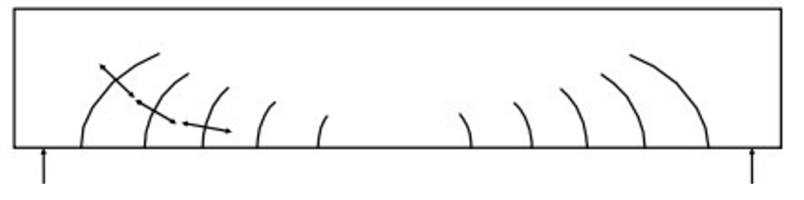
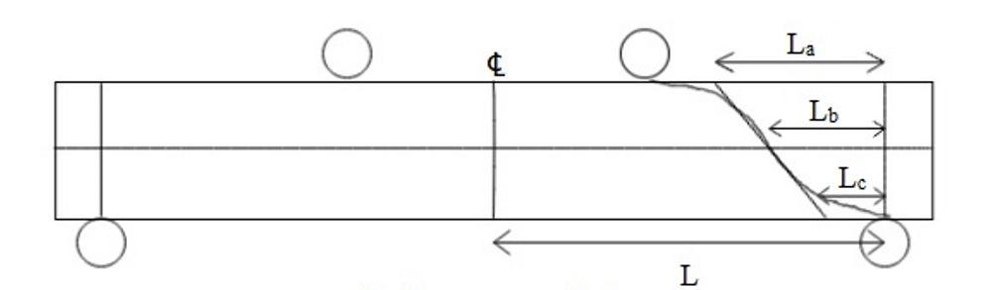

Bending moments in reinforced beams are accompanied by transverse shear forces, axial forces and torsion. The Reinforced Concrete (RC) beam is thus designed for the ultimate limit state in flexural shear, i.e. shear associated with varying bending moment.  Failure of a reinforced concrete beam in flexural shear often may not lead to an immediate collapse by itself. However, it can significantly reduce flexural strength (moment−bearing capacity) as well as ductility. Hence, the state of (impending) shear failure is treated by the Code as an ultimate limit state (i.e., limit state of collapse) for design purposes. The behavior of RC under shear (flexural shear alone or in combination with torsion and axial forces) is very complex ⎯ mainly because of its non-homogeneity, presence of cracks and reinforcement, and the nonlinearity in its material response.
From basic mechanics of material we know, that the flexural (normal) stress fx the shear stress τ at any point in the section, located at a distance y from the neutral axis, are given by:
 

 

 
where I is the second moment of area of the section about the neutral axis, Q the first moment of area about the neutral axis of the portion of the section above the layer at distance y from the neutral axis , and b is the width of the beam at the layer at which τ is calculated. The variation of shear stress is parabolic, with a maximum value at the neutral axis and zero values at the top and bottom of the section.
 

 

 
Consider an element at a distance y from the neutral axis and neglecting any possible vertical normal stress fy caused by the surface loads, the combined flexural and shear stresses can be resolved into equivalent principal stresses f1 and f2 acting on orthogonal planes, inclined at an angle α to the beam axis (as shown):
 

 

 
The values of forces f1 and f2 are given by the equation above considering the former to be tensile force and the latter to be compressive force. The relative values of f1 and f2 depend on the magnitudes of fx and τ and also the angle α. A condition of pure sheer occurs for the elements at the neutral axis (where τ is maximum and fx = 0), whereby f1 = f2 = τmax and α = 45◦. The stress pattern is indicated in the figure below:

 

 

 
<h4>Types of Cracks</h4>
 
In general, in a beam under flexure and shear, a biaxial state of combined tension and compression exists at various points. The so-called ‘diagonal tension cracks’ can be expected to occur in reinforced concrete beams in general, and appropriate shear reinforcement is required to prevent the propagation of these cracks. When a ‘flexural crack’ occurs in combination with a ‘diagonal tension crack’, this crack is referred to as flexure shear crack. 
Sometimes, the inclined crack propagates along the tension reinforcement towards the support. Such cracks are referred to as secondary cracks or splitting cracks. These are attributed to the wedging action of the tension bar deformations. 
In short−span beams which are relatively deep and have thin webs and are subjected to high shear stresses τ (due to concentrated loads) and relatively low flexural stresses fx, it is likely that the maximum principal tensile stress is located at the neutral axis level at an inclination α = 45◦ (to the longitudinal axis) the resulting cracks are termed web shear cracks or diagonal tension cracks.
 

 
<h4>Design Approach of IS-456 ( 2000 ) </h4>
 
For prismatic members of rectangular (or flanged) sections, the Code (Cl. 40.1) uses the term nominal shear stress τv , defined at the ultimate limit state, as follows:
 

 
where Vu is the factored shear force at the section under consideration, b is the width of the beam and d the effective depth of the section. It should be noted that τv is merely a parameter intended to aid design and to control shear stresses in reinforced concrete; it does not actually represent the true average shear stress.
Design shear strength τc of concrete in reinforced concrete beams without shear reinforcement is limited to the value of the nominal shear stress τv corresponding to the load at which the first inclined crack develops; some partial factor of safety(1.2) is also used. 
 

Fig 7: Values of τc according to IS-456

<table>
<thead>
  <tr>
    <th colspan="7">Table 19 Design Shear Strength of Concrete</th>
  </tr>
</thead>
<tbody>
  <tr>
    <td colspan="7">( Clauses 40.2 , 40.2.2 , 40.3 , 40.4.5.3 , 41.3.3 and 41.4.3 )</td>
  </tr>
  <tr>
    <td rowspan="2">100*(As/bd)</td>
    <td colspan="6">Concrete Grade</td>
  </tr>
  <tr>
    <td>M15</td>
    <td>M20</td>
    <td>M25</td>
    <td>M30</td>
    <td>M35</td>
    <td>M40</td>
  </tr>
  <tr>
    <td>1</td>
    <td>2</td>
    <td>3</td>
    <td>4</td>
    <td>5</td>
    <td>6</td>
    <td>7</td>
  </tr>
  <tr>
    <td></td>
    <td></td>
    <td></td>
    <td></td>
    <td></td>
    <td></td>
    <td></td>
  </tr>
  <tr>
    <td>&lt;=0.15</td>
    <td>0.28</td>
    <td>0.28</td>
    <td>0.29</td>
    <td>0.29</td>
    <td>0.29</td>
    <td>0.3</td>
  </tr>
  <tr>
    <td>0.25</td>
    <td>0.35</td>
    <td>0.36</td>
    <td>0.36</td>
    <td>0.37</td>
    <td>0.37</td>
    <td>0.38</td>
  </tr>
  <tr>
    <td>0.5</td>
    <td>0.46</td>
    <td>0.48</td>
    <td>0.49</td>
    <td>0.5</td>
    <td>0.5</td>
    <td>0.51</td>
  </tr>
  <tr>
    <td>0.75</td>
    <td>0.54</td>
    <td>0.56</td>
    <td>0.57</td>
    <td>0.59</td>
    <td>0.59</td>
    <td>0.6</td>
  </tr>
  <tr>
    <td>1</td>
    <td>0.6</td>
    <td>0.62</td>
    <td>0.64</td>
    <td>0.66</td>
    <td>0.67</td>
    <td>0.68</td>
  </tr>
  <tr>
    <td>1.25</td>
    <td>0.64</td>
    <td>0.67</td>
    <td>0.7</td>
    <td>0.71</td>
    <td>0.73</td>
    <td>0.74</td>
  </tr>
  <tr>
    <td>1.5</td>
    <td>0.68</td>
    <td>0.72</td>
    <td>0.74</td>
    <td>0.76</td>
    <td>0.78</td>
    <td>0.79</td>
  </tr>
  <tr>
    <td>1.75</td>
    <td>0.71</td>
    <td>0.75</td>
    <td>0.78</td>
    <td>0.8</td>
    <td>0.82</td>
    <td>0.84</td>
  </tr>
  <tr>
    <td>2</td>
    <td>0.71</td>
    <td>0.79</td>
    <td>0.82</td>
    <td>0.84</td>
    <td>0.86</td>
    <td>0.88</td>
  </tr>
  <tr>
    <td>2.25</td>
    <td>0.71</td>
    <td>0.81</td>
    <td>0.85</td>
    <td>0.88</td>
    <td>0.9</td>
    <td>0.92</td>
  </tr>
  <tr>
    <td>2.5</td>
    <td>0.71</td>
    <td>0.82</td>
    <td>0.88</td>
    <td>0.91</td>
    <td>0.93</td>
    <td>0.95</td>
  </tr>
  <tr>
    <td>2.75</td>
    <td>0.71</td>
    <td>0.82</td>
    <td>0.9</td>
    <td>0.94</td>
    <td>0.96</td>
    <td>0.98</td>
  </tr>
  <tr>
    <td>&gt;=3</td>
    <td>0.71</td>
    <td>0.82</td>
    <td>0.92</td>
    <td>0.96</td>
    <td>0.99</td>
    <td>1.01</td>
  </tr>
</tbody>
</table>

 

For finding out the predicted value of the beam sample we require the percentage tension reinforcement along with the grade of concrete used and using that value we find out the corresponding τc . 
It should be noted that infinitely increasing the value of percentage tension reinforcement doesn’t increase the value of design shear stress of beam after a particular point.

 
<h4>Observed value of RC Beam without Shear Reinforcement</h4>
 
The following figure shows the loading induced in the RC beam. The setup used is of four point loading. We calculate the predicted shear strength when the first crack appears. The shear force diagram and the bending moment diagram of the RC beam due to applied loading is shown below.
 

 

Fig 8: Shear Force Diagram and Bending Moment Diagram for Four-Point Loading Setup

We first note down the load at which the shear crack appears which spans along the entire depth of the beam as shown in the Fig. 1. For the calculation we approximate a linear crack (Fig. 2) and note the distance from the central line. The formula used for calculating the shear force due to which the crack was developed is as follows:

 

 

 

 

Fig 9: Method of Calculating Effective Area contributing to shear force in RC Beam at Failure 

 
Taking:
<ol>
<li>Failure load : P</li>
<li>Overall depth of beam : D</li>
<li>Breadth of beam : b</li>
</ol>
Taking the approximate section to calculate self-weight as trapezium the volume of the same is:
 

 
<h3>Basic Guidelines For Conducting The Experiment</h3>
 
The beam section shown below is prepared for casting and conducting the experiment-
Dimensions of the beam = (2000x150x200)mm3      (LengthxBreadthxDepth)
Cover is the distance between the directly exposed concrete surface to the nearest reinforcement bar. Cover blocks are provided at either side of the beam that provide protection to the reinforcement cage. The cover provided in our experiment is about 25mm.
Before casting the beam, the reinforcement cage is prepared after necessary calculations. The cage and cover blocks are then placed in the casting mould. The mould is then filled with concrete and finished using a vibration machine and other necessary equipment. The casted beam is then allowed to dry and strengthen for 28 days. The cube and concrete beam specimens are also casted along with the Beam without shear reinforcement. 
Before starting the experiment, some additional information is required from various other experiments. The properties and their requirements are listed below-
<ul>
<li>
Compressive Strength of Concrete(fcm)
 
This property of concrete is obtained from the “Compressive Test of Concrete (Cube)” experiment. This property is used while calculating the predicted value of Shear Strength of RC beam. (Refer to Table 19)

Material to be casted: 3 Concrete Cube specimen (150x150x150) mm3
</li>
</ul>
After 28 days, the beam and other concrete specimens are tested for their respective properties. The detailed procedure for UR beam testing is given in the Procedure section. 

Instrumentation in RC beam before testing:
<ul>
<li>Load cell is connected to the hydraulic jet to apply and measure load on the beam.</li>
<li>The beam is tested using a four point loading setup.</li>
</ul>
 
<h4>Recommended Beam Section</h3>
 
 

 

 
The recommended beam section includes the following:
<ul>
<li>Beam dimensions: 2000*200*150 mm (L*b*D)</li>
<li>The tension reinforcement includes 3 bars of 12mm diameter. The steel used is Fe500 and M25 but the measured values of the same are reported in experiment, “Compressive Strength of Concrete (Cube)” and “Tensile Strength of Reinforcement Steel”.</li>
<li>The compression reinforcement includes 2 bars of 8mm diameter.</li>
<li>The stirrups are provided at the four points, two points where the load is provided and two supports.</li>
<li>L = 2000</li>
<li>L' = 1800</li>
<li>b = 150</li>
<li>D = 200</li>
<li>Cover = 25</li>
<li>d = 169</li>
<li>Ast = 3 - 12φ</li>
<li>fck = 25 MPa</li>
<li>fy = 500 MPa</li>
</ul>
