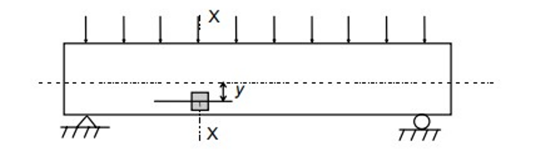

Bending moment in Reinforced Concrete (RC) is accompanied by transverse shear forces, axial forces and torsion. The RC beam is thus designed for the ultimate limit state in flexural shear, i.e. shear associated with varying bending moment. Failure of a RC beam in flexural shear often may not lead to an immediate collapse by itself. However, it can significantly reduce flexural strength (moment−bearing capacity) as well as ductility. Hence, the state of (impending) shear failure is treated by the Code as an ultimate limit state (i.e., limit state of collapse) for design purposes. The behavior of RC under shear (flexural shear alone or in combination with torsion and axial forces) is very complex ⎯ mainly because of its non-homogeneity, presence of cracks and reinforcement, and the nonlinearity in its material response. From basic mechanics of material, we know that the flexural (normal) stress fx and the shear stress τ at any point in the section, located at a distance y from the neutral axis, are given by:
 

fx = My&frasl;I

 

τ = VQ&frasl;Ib

 
where I is the second moment of area of the section about the neutral axis, Q the first moment of part of the area of the cross section above the level of interest above the neutral axis, and b is the width of the beam at the layer at which τ is calculated. The variation of shear stress is parabolic, with a maximum value at the neutral axis and zero values at the top and bottom of the section.
 

<b> Fig. 1: Element of an RC beam under uniform loading</b>

 

<b> Fig. 2: Distribution of shear force induced in beam cross-section due to uniform loading.</b>

 
Consider an element at a distance y from the neutral axis and neglecting any possible vertical normal stress fy caused by the surface loads as shown in Fig. 1 and 2. Then, the combined flexural and shear stresses can be resolved into equivalent principal stresses f1 and f2 acting on orthogonal planes, inclined at an angle α to the beam axis as shown in Fig. 3.
 

<b>Fig. 3: Principal stresses induced in beam element due to combination of shear and tensile forces</b>
 

The values of stresses f1 and f2 are given by the above equation considering the former to be tensile force and the latter to be compressive force. The relative values of f1 and f2 depend on the magnitudes of fx and τ and also the angle α. A condition of pure sheer occurs for the elements at the neutral axis (where τ is maximum and fx = 0), whereby f1 = f2 = τmax and α = 45◦. The stress pattern in an RC beam that is loaded by a uniformly distributed load is shown in Fig. 4.
 

<b>Fig. 4: Principal stress trajectories.</b>

 
<h4>Types of Cracks</h4>
In general, in a beam under flexure and shear, a biaxial state of combined tension and compression exists at various points. The so-called ‘diagonal tension cracks’ can be expected to occur in RC beams in general, and appropriate shear reinforcement is required to prevent the propagation of these cracks. When a ‘flexural crack’ occurs in combination with a ‘diagonal tension crack’, this crack is referred to as flexure shear crack. 
Sometimes, the inclined crack propagates along the tension reinforcement towards the support. Such cracks are referred to as secondary cracks or splitting cracks. These are attributed to the wedging action of the tension bar deformations. A typical cracking pattern in an RC beam that is loaded by a uniformly distributed load is shown in Fig. 5.

<b>Fig. 5: Types of crack in an RC beam.</b>

 
<h4>Design Approach of IS-456 (2000) </h4>
For prismatic members of rectangular (or flanged) sections, the Code (Cl. 40.1) uses the term nominal shear stress τv , defined at the ultimate limit state, as follows:
 

 
where Vu is the factored shear force at the section under consideration, b is the width of the beam and d the effective depth of the section. It should be noted that τv is merely a parameter intended to aid design and to control shear stresses in reinforced concrete; it does not actually represent the true average shear stress. Design shear strength τc of concrete in reinforced concrete beams without shear reinforcement is limited to the value of the nominal shear stress τv corresponding to the load at which the first inclined crack develops; some partial factor of safety (equal to 1.2) is also used. 
 

Table 1: Values of τc as per IS-456 (2000) 

<table>
<thead>
  <tr>
    <th colspan="7"></th>
  </tr>
</thead>
<tbody>

  <tr>
    <td rowspan="2">100(As/bd)</td>
    <td colspan="6">Concrete Grade</td>
  </tr>
  <tr>
    <td>M15</td>
    <td>M20</td>
    <td>M25</td>
    <td>M30</td>
    <td>M35</td>
    <td>M40</td>
  </tr>
  <tr>
    <td>1</td>
    <td>2</td>
    <td>3</td>
    <td>4</td>
    <td>5</td>
    <td>6</td>
    <td>7</td>
  </tr>
  <tr>
    <td></td>
    <td></td>
    <td></td>
    <td></td>
    <td></td>
    <td></td>
    <td></td>
  </tr>
  <tr>
    <td>&lt;=0.15</td>
    <td>0.28</td>
    <td>0.28</td>
    <td>0.29</td>
    <td>0.29</td>
    <td>0.29</td>
    <td>0.3</td>
  </tr>
  <tr>
    <td>0.25</td>
    <td>0.35</td>
    <td>0.36</td>
    <td>0.36</td>
    <td>0.37</td>
    <td>0.37</td>
    <td>0.38</td>
  </tr>
  <tr>
    <td>0.5</td>
    <td>0.46</td>
    <td>0.48</td>
    <td>0.49</td>
    <td>0.5</td>
    <td>0.5</td>
    <td>0.51</td>
  </tr>
  <tr>
    <td>0.75</td>
    <td>0.54</td>
    <td>0.56</td>
    <td>0.57</td>
    <td>0.59</td>
    <td>0.59</td>
    <td>0.6</td>
  </tr>
  <tr>
    <td>1</td>
    <td>0.6</td>
    <td>0.62</td>
    <td>0.64</td>
    <td>0.66</td>
    <td>0.67</td>
    <td>0.68</td>
  </tr>
  <tr>
    <td>1.25</td>
    <td>0.64</td>
    <td>0.67</td>
    <td>0.7</td>
    <td>0.71</td>
    <td>0.73</td>
    <td>0.74</td>
  </tr>
  <tr>
    <td>1.5</td>
    <td>0.68</td>
    <td>0.72</td>
    <td>0.74</td>
    <td>0.76</td>
    <td>0.78</td>
    <td>0.79</td>
  </tr>
  <tr>
    <td>1.75</td>
    <td>0.71</td>
    <td>0.75</td>
    <td>0.78</td>
    <td>0.8</td>
    <td>0.82</td>
    <td>0.84</td>
  </tr>
  <tr>
    <td>2</td>
    <td>0.71</td>
    <td>0.79</td>
    <td>0.82</td>
    <td>0.84</td>
    <td>0.86</td>
    <td>0.88</td>
  </tr>
  <tr>
    <td>2.25</td>
    <td>0.71</td>
    <td>0.81</td>
    <td>0.85</td>
    <td>0.88</td>
    <td>0.9</td>
    <td>0.92</td>
  </tr>
  <tr>
    <td>2.5</td>
    <td>0.71</td>
    <td>0.82</td>
    <td>0.88</td>
    <td>0.91</td>
    <td>0.93</td>
    <td>0.95</td>
  </tr>
  <tr>
    <td>2.75</td>
    <td>0.71</td>
    <td>0.82</td>
    <td>0.9</td>
    <td>0.94</td>
    <td>0.96</td>
    <td>0.98</td>
  </tr>
  <tr>
    <td>&gt;=3</td>
    <td>0.71</td>
    <td>0.82</td>
    <td>0.92</td>
    <td>0.96</td>
    <td>0.99</td>
    <td>1.01</td>
  </tr>
</tbody>
</table>

 
It should be noted that infinitely increasing the value of percentage tension reinforcement doesn’t increase the value of design shear stress of beam after a particular point.

 
<h4>Experimental shear strength of an RC Beam without shear reinforcement</h4>

Fig. 6 shows the loading induced in the RC beam. The setup used is of four point loading. The predicted shear strength is estimated when the first crack appears. The shear force diagram and the bending moment diagram of the RC beam due to applied loading is shown in the same figure.
 

 

<b>Fig 6: Shear force diagram and bending moment diagram for four-point loading setup.</b>

To estimate the shear force at failure due to applied load and self-weight, the shear crack is apprimated by a linear line as shown in Fig. 7,8 and 9. The lengths La and Lc are measured ; Lb = (La + Lc)/2.

 

<b>Fig. 7: Cracked section at failure.</b>

 

<b>Fig. 8: Section considered for calculating shear force at failure due to applied load and self-weight.</b>

 

<b></b>

 

Fig 9: Approximate section considered for calculating shear force at failure due to applied load and self-weight.

 
The formula used for calculating the shear force due to which the crack was developed is as follows. Taking:
<ol>
<li>Failure load : P</li>
<li>Overall depth of beam : D</li>
<li>Width of beam : b</li>
</ol>

 
<h3>Basic Guidelines for conducting the experiment</h3>
The beam section shown in Fig. 10 is cast for conducting the experiment. The cast beam is allowed to dry and strengthen for 28 days. 
 

 

<b>Fig. 10: Recommended beam section.</b>

 
For performing this experiment, the recommended material properties and dimensions are as follow.
<ul>
<li>fck = 25 MPa</li>
<li>fy = 500 MPa</li>
<li>L = 2000 mm</li>
<li>L' = 1800 mm</li>
<li>b = 150 mm</li>
<li>D = 200 mm</li>
<li>Cover = 25 mm</li><li>Tension reinforcement: 3 bars of 12 mm diameter</li>
<li>Compression reinforcement: 2 bars of 8mm diameter</li>
<li>Stirrups are provided at the four points, at two points where the load is applied and at two supports.</li>

</ul>
